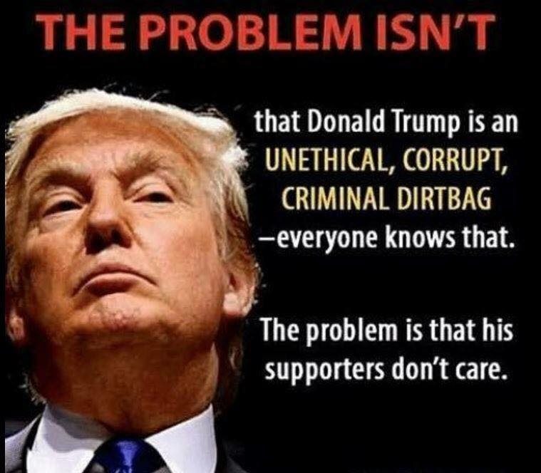

```{r setup, include=FALSE}
knitr::opts_chunk$set(echo = TRUE)
library(tidyverse)
library(dplyr)
library(stringr)
library(ggplot2)
library(tidytext)
library(tidyr)

tweets <- read_csv("tweets.csv")
tweets_s <- tweets["text"]
```


<center>
# The Most Dangerous WMD
</center>

  Claude is a 65 year old man who lives alone in Montgomery, Alabama. His wife died a few years ago, and that hit him hard, but his family still comes to visit. He has two children and one grandchild - his daughter didn’t marry - and he gets to see them almost every month. He’s still healthy and does calisthenics in his house every morning, he makes model planes out of plywood and wood glue, and he reads a lot. He used to read mostly books, sci-fi and fantasy - recently though, as recent as a few years ago, his daughter introduced him to the miraculous advent of the internet. It was through the internet that he found Facebook, connected with his friends and family online, and thus was born new-age Claude. Claude version 2.0. He adopted a new hobby.
<div class="poster2">

</div> Now, Claude spends the majority of his time doing research online and posting political warnings - to make sure his friends and family know what kinds of things are going underneath the political sheets - and looking at dog memes. Most of us know someone like this. He or she posts political memes or “warnings,” showcasing their political opinions, which, of course, is an action perfectly within their rights. It’s admirable, even - they are demonstrating their freedom of speech, and giving support to the candidates they prefer. Social media has brought a powerful new way to express democracy. But there is something here that many don’t pay heed to: Claude posts some meme about crooked Hilary, which he was forwarded by someone else. Who in turn had it forwarded to them, all the way down to the bottom of the chain. In 2016, nearing the 2016 US presidential election, the Federal Bureau of Investigation discovered that often, the bottom of the chain wasn’t another 65 year old man making memes in his living room. It was third-party agencies from [Russia](https://techcrunch.com/2018/05/10/russian-facebook-ads-house-intelligence-full-list/) and other countries, intentionally creating politically charged messages to divide American politics. This was not an isolated case - but it went to show something that we have been brushing under the rug: That the ability to use big data and the rise in internet use has caused people to spend a lot of time subconsciously picking up messages which are politically or commercially charged. This has potentially extremely dangerous consequences - and there’s not a lot we can do to stop it.

We like to think of ourselves as unbiased and capable of making our own decisions, informed by our wide experiences and infallible intelligence. If we’re comparing ourselves to monkeys, sure, this assertion proves true. But that’s a rather low bar. In fact, one of the only things setting us apart from monkeys is just that: our ability to separate ourselves from bias and create immensely detailed fictions. This is a phenomenon that psychologists and sociologists have studied for years - esteemed historian Yuval Noah Harari discusses it in impressive detail     in his book Sapiens. This ability to create fictions - things like money, government, and even, as Harari argues, human rights - has set us apart and defined us for thousands of years. These fictions come together to create worldview, or [Weltanschauung](https://www.merriam-webster.com/dictionary/Weltanschauung): our personal view of the world based on individual experience, sensory perception, and most importantly, external influence. And this isn’t the first time governments have tried to manipulate it. The ancient Egyptians, for example, created the fiction of the pharaoh - making the ruler unquestionable and by all means perfect. This has continued in the Incas, British Commonwealth, the Soviet republic, and it continues today. Be their motivations sinister or benign, as long as we have worldview, there will be those who seek to change it.

The US government is no exception. In the 2020 elections, Donald Trump spent 2.9 million dollars and Joe Biden 6.1 million, all on targeted political advertising. All of that money went to Facebook ads - a lucrative choice almost guaranteed to net the candidates thousands of votes. Facebook puts a lot of work in their algorithms which target individuals, tailoring which ads they see and which of their friends’ posts they see based on what they click on, what they search in google, and much more. Obviously this
<div class="poster1">
  
</div>

can become a serious problem. Pay off Facebook employees and they’ll put a little bit of extra bias to what you want people to see. Facebook doesn’t take bribes - or at least they say they don’t - but it remains a fact that the developers of Facebook’s algorithm and the people making the decisions hold an incredible amount of power. They can tailor what people see - and with people spending an average of over [3 hours](https://whatagraph.com/blog/articles/how-much-time-do-people-spend-on-social-media) on social media every single day - Facebook is tailoring a lot. Now, Facebook claims to be changing to become more [transparent](https://blog.hootsuite.com/facebook-algorithm/), lessening one of the sins of a [WMD](https://weaponsofmathdestructionbook.com/), or  "Weapon of Math Destruction," as Dr. Cathy O'Neil describes in her book of the same name, algorithms characterized by their opacity, scale, and damage. Yet Facebook remains the top social media site in the world, leaving them with an intense responsibility and a lot to work on. 

To put in perspective how effective these advertisements are, let’s take a look at a different social media platform: Twitter. The 200,000 tweets sent out in the 2016 election. 
``` {r plot1, echo=FALSE}
my_stopwords <- tibble(word = c(as.character(1:10), "http", "https", "t.co", "rt", "amp", "tcot", "2", "pjnet", "god", "gop", "vote"))

tidy_tweets <- tweets_s %>%
  unnest_tokens(word,text)
tidy_tweets <- tidy_tweets %>%
  anti_join(stop_words) %>%
  anti_join(my_stopwords)

# The words that are filtered out here are filtered out because they are often words used colloquially or are "black" and "white", which are words that are likely used in reference to skin color here. Again, this plot is a bit of a placeholder for the abline plot that I plan on using for the final project.
nrc_jn <- get_sentiments("nrc") %>%
  filter(sentiment == "joy" | sentiment == "negative", word != "love", word != "black", word != "white") 


tidy_tweets %>%
  count(word, sort = TRUE) %>%
  filter(n > 2500) %>%
  mutate(word = reorder(word, n)) %>%
  ggplot(aes(n, word)) +
  geom_col() +
  labs(y = NULL)

```

This plot shows a frequency analysis of several of the 200,000 tweets. This first plot makes clear, firstly, when these tweets were posted. With Trump and Clinton being the top two words on the list, with an occurrence of over ten-thousand, it is clear that these tweets were taken during the 2016 elections. In fact, almost all of the top word occurrences deal with some political candidate or another. Right off the bat, these are highly controversial tweets. But then, they’re tweets, and it’s election season - if taken out of context, this could easily be construed as simply a random sampling of tweets from 2016. The second plot is where things become much clearer. 


```  {r plot2, echo=FALSE}

tidy_tweets %>%
  inner_join(nrc_jn) %>%
  count(word, sort = TRUE) %>%
  filter(n > 1000) %>%
  mutate(word = reorder(word, n)) %>%
  ggplot(aes(n, word, fill="red")) +
  geom_col() +
  labs(y = NULL)
```

This plot is a sentiment analysis using the sentiment lexicon “[emolex](http://saifmohammad.com/WebPages/NRC-Emotion-Lexicon.htm)” put together by Saif Mohammed and Peter Turney. The words shown are the most emotionally charged words. Clearly, words like “die,” “money,” “war,” and “hate,” shouldn’t be above a word like “happy.” But they are, and they’re connected with political candidates to proverbially stir up the pot. 

These sentiments target our feelings. They program us to think a certain way about certain people, and put a lot of our political agency (and even our financial agency, in the case of commercial ads) in the hands of people who know how to manipulate it. And most importantly of all, they pit us against each other. We have a [tendency](https://www.ncbi.nlm.nih.gov/pmc/articles/PMC3833634/) to think in an Us vs Them fashion. If I’m wearing a mask and you’re not wearing a mask, we’re in different tribes, so we treat each other differently. What these corporations and governments are given is the power to place us into these different tribes. Splitting us by opinion, and by fundamental belief. This used to be done by geolocation or as a coincidence of birth, thus by the groups we spend time around - but now, when everyone has access to the internet, strife and contention is diametrically splitting us faster and in more places than ever before. We might love Uncle Claude but he shares a different opinion than us - so we don’t treat him the same. We only visit him once a month. This is something that harms our human connections, and something that harms our society in many other ways. It’s another case of one entity - the creators of these algorithms - having far more power over every other individual. It’s a WMD - and by far the most dangerous.


Sources:

I collected my data from NBC news, who reported tweets Twitter tied to malicious activity coming from Russia. See NBC's full article [here](https://www.nbcnews.com/tech/social-media/now-available-more-200-000-deleted-russian-troll-tweets-n844731). 

The images were collected from my own Facebook feed.

https://techcrunch.com/2018/05/10/russian-facebook-ads-house-intelligence-full-list/

https://www.forbes.com/sites/martyswant/2020/11/02/what-joe-bidens-and-donald-trumps-facebook-ads-reveal-about-their-campaign-strategies/?sh=4fb2a6f95c83

https://whatagraph.com/blog/articles/how-much-time-do-people-spend-on-social-media

https://blog.hootsuite.com/facebook-algorithm/

https://weaponsofmathdestructionbook.com/

http://saifmohammad.com/WebPages/NRC-Emotion-Lexicon.htm
